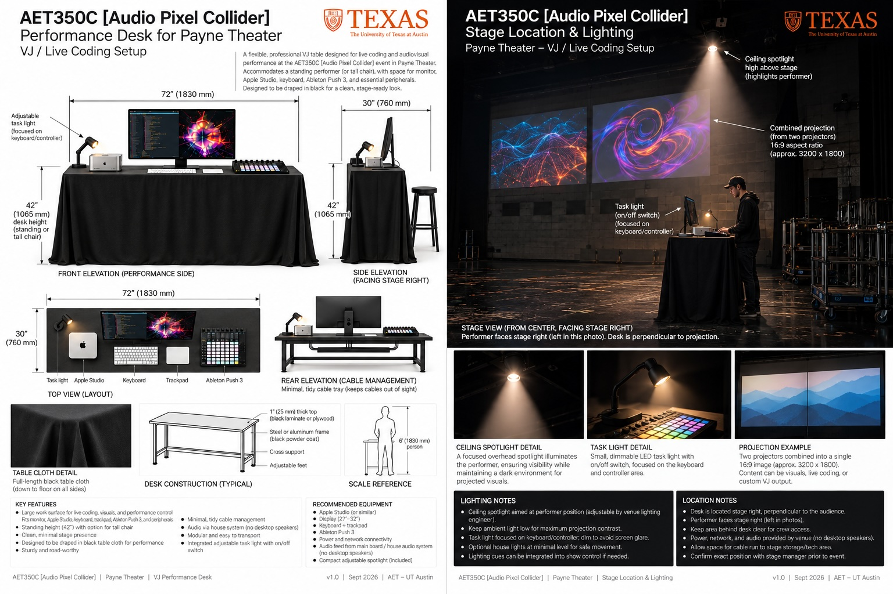

**AET350C · Fall 2026**

# AudioPixel Live Coding Final Project

**Live visual performance for the AudioPixel event on Thursday, November 19, 2026**

| | |
| --- | --- |
| **Project runs** | Wednesday, October 7 – Thursday, November 19 (classes meet Monday and Wednesday) |
| **Tool** | AET Thunk Machine (live coding environment) |
| **Checkpoints** | 7 short submissions that build into your final piece. Checkpoints 1–4 are Programming Assignments 6–9; Checkpoints 5–7 are part of the final project |
| **Final package due** | Wednesday, November 18, before the dress rehearsal: your performance file, loaded on the Mac Studio performance machine in Payne Theater |
| **Performance** | Thursday, November 19, public event; roughly 8–15 minutes each (to be finalized) |
| **Post-event recording and reflections due** | Monday, November 30 |

---

## The project

You will create, rehearse, and perform a live visual piece that plays alongside live music at AudioPixel. The musicians, from Chris Osley's class and the Ableton artist community, will perform music that is generally electronic and has a steady beat. You will not be paired with a specific musician, so your piece (and you) will need to be flexible enough to respond to whatever is played. AudioPixel is sponsored by **Ableton**, and the event is built around Ableton's tools and community: Ableton artists will perform, an Ableton Push 3 will be available for your performance, and tempo and beat phase will reach your visuals through Ableton Link (Thunk Machine handles most of the details for you).

You will perform visuals alongside music from the main stage, played by students from Chris Osley's class and Ableton artists. Your visuals should support and enrich the overall AudioPixel experience rather than dominate it. That said, because of the stage setup, your visuals will be the first thing guests see as they enter the stage area. Your goal is to accent and supplement the overall event: visuals that hold the audience's attention and fit the mood and energy of the music, rather than pulling against it.

A strong piece has a clear artistic idea, expressed through imagery, color, movement, and pacing, and it changes over time because of the groundwork you lay in advance and the decisions you make while performing. You don't need an overly complex system; a simple one you understand well, can explain, and can perform fluidly will do well. Even simple lines and shapes, done right, can be mesmerizing. Use whatever techniques serve your idea: scenes, clips, controls, modulation, live code edits, shaders, images, or video. You do not need to use every feature.

While much of this brief is about performance, the project is rooted in code. What you are really developing is your ability to write clear, well-structured modern JavaScript and to express ideas fluently in code, both in the work you prepare and live on stage. The performance is where that fluency shows.

## Your performance must include

- **An artistic idea.** A clear intention behind your choices of imagery, color, form, and movement, and a considered response to the music.
- **Your own work.** Your main idea and central visuals must be your own original code. Using and changing Library patches is allowed and encouraged, as is borrowing ideas or code from others, but only as supporting elements in your composition, with credit, not as a substitute for your own work. You may use AI tools, as long as you learn from them and understand what the code they produce is doing well enough to explain it. Credit what you used AI for in your project document.
- **Command of modern JavaScript.** Your code should demonstrate your command of modern JavaScript, including effective use of arrays, functions, and objects.
- **Live coding.** Your live actions must include editing code during the performance, not only using the Push 3.
- **A performance file.** Built in AET Thunk Machine and exported to be loaded and performed at the event.
- **Show-ready materials.** All required assets, setup notes, and a tested backup recording.
- **A dry run.** A complete run-through of your performance at the dress rehearsal on Wednesday, November 18.

## How the music and stage setup will work

**At the event,** you will have three live inputs:

- **Audio feed** (from the main soundboard): the sound itself. Use it for audio-reactive visuals that respond to volume, frequency content, or texture.
- **Tempo and beat phase** (from the performers' deck through **Ableton Link**, a technology that keeps tempo and beat in sync across devices on a network): tempo is the speed of the music in beats per minute, and beat phase is where the music is within the current beat. Use them to time movement and changes so they land on the beat. If Ableton Link isn't working or isn't available during your performance, be ready to use Thunk Machine's tap tempo feature instead. Aligning your visuals to the beat with tap tempo can be very effective.
- **Ableton Push 3:** a controller available as part of your performance setup. If you choose to use it, you can trigger and adjust your visuals by hand during the performance.

**The stage.** Below is the requested performance setup for Payne Theater; final details may change.

## Your performance slot

Each of you will perform for a time slot of roughly 8 to 15 minutes. This is tentative and will be finalized based on the length of the show and the number of performers. Tanmayee will create the full run of show for the event, schedule each performer's slot, and organize the running order as the event draws nearer. If you'd like to perform longer, let her know; extra time has been requested and available in past shows.

## How the project works over the next six weeks

Over the next six weeks you will build one piece, step by step, and perform it on November 19. Instead of a single deadline at the end, the work is broken into seven checkpoints, each one the next step on the same piece: exploring ideas, pitching a direction, building a first playable section, researching a technique, running the whole performance, revising it, and preparing it for the show. Each stage is introduced in class, and its Canvas assignment has the full requirements. Use the feedback from each checkpoint to shape the next.

Alongside your piece, you will keep a **project document** that describes what you are building and how it is developing. Start it with Checkpoint 1 and submit the updated version with every checkpoint, so by the end it tells the full story of your project. [Your project document](#your-project-document), below, explains what it should contain.

At each checkpoint, keep a copy of everything you submit: your **export** (the .json file Thunk Machine saves of your performance, including your code and scenes), your project document, and any recordings or screenshots. Name your files so you can tell the versions apart. Thunk Machine is new software, so also export often between checkpoints to keep a recent backup, and report any bugs as soon as you find them.

If you miss a class or fall behind, complete the missing stage anyway, because the later stages depend on it, and ask about an extension if you need one. Late credit and attendance follow the course policy, so completing a missed stage does not automatically restore its credit.

## Your project document

Your project document describes what you are building and how it developed. It grows with each checkpoint, and by the end it should include:

- **Title and concept:** your project title, your artistic idea, and what you want the visuals to express.
- **Technical approach:** how your code is structured, including your use of arrays, functions, and objects; the Thunk Machine features and Library patches you use; and the technique you researched.
- **Response to the music:** how your visuals use the audio feed, tempo, and beat phase, and how you plan to respond live.
- **Live actions and cue map:** your opening, key cues, transitions, and ending, and what you control by hand, including on the Push 3 if you use it.
- **Development log:** key milestones, the feedback you received and how you responded, problems you hit and how you solved them, and screenshots of your work along the way.
- **Credits:** sources for any Library patches, outside code, images, or video.
- **AI use:** where and how you used AI tools, what you asked for, what you kept or changed, and what you learned from it.
- **After the event:** how the performance went and your reflections (see [After the event](#after-the-event)).

For a complete example of a project document at every stage, see the sample project *Green Phosphor*.

## Checkpoints

Each checkpoint lists five things to address. **Checkpoints 1–4** are graded as programming assignments: on how completely and thoughtfully you address each item, and on whether your code works and you can explain it. **Checkpoints 5–7** aren't graded on their own; they are how you build toward the final project, which is graded as a whole with the rubric under [Grading](#grading).

### 1. Exploration and brainstorming: Assignment 6 (Wed Oct 14)

**Submit:** the first version of your project document, covering the five points below; an early live coding export; and a screenshot or short recording.

1. **Starting points:** describe what is inspiring you, such as an artist or performance, a visual idea, a technique, a piece of music, or anything else, and what draws you to it.
2. **Three directions:** describe three possible visual directions. Sketches, drawings, or reference images are welcome.
3. **Experiment:** show one small visual experiment in Thunk Machine.
4. **Test with music:** try your experiment with electronic music that has a steady beat (assume this is what you will perform to), and explain what you noticed.
5. **Direction and question:** choose one direction to develop and one question to investigate.

### 2. Creative pitch: Assignment 7 (Mon Oct 19)

**Submit:** your project document, updated with your pitch (the five points below), and an export of your early experiments, uploaded to Canvas by Oct 19. Present the pitch in class on Oct 19 or 21, in about 5 minutes: a few slides, a short live demo, mockup, or whatever best communicates your idea, and questions for the class.

1. **Artistic idea:** explain what you want the visuals to express.
2. **Early looks:** show at least one early live coding experiment that gives a first look at your visuals. Sketches or drawings can add to it, but not replace it.
3. **Response to the music:** identify qualities or moments that shape your direction, and how you'll respond to them (for example, through frequency, beat, waveform, timing, controls, or modulation).
4. **Live actions:** describe what you plan to change or trigger while performing.
5. **Next step:** identify what you need to build, research, or test.

### 3. Revised direction and first playable section: Assignment 8 (Mon Oct 26)

**Submit:** your project document, updated with your response to pitch feedback and your revised direction; an updated export; and a short video, with sound, of a passage you can perform.

1. Identify the feedback from your pitch you used and why. You may keep an original choice if you explain your reasoning.
2. Show how your direction changed or became clearer as a result.
3. Provide a working live coding passage that responds to the music.
4. Demonstrate at least one purposeful live action.
5. Identify one thing that works and one thing to improve.

### 4. Technical research and enhanced prototype: Assignment 9 (Wed Oct 28)

**Submit:** your project document, updated with your research (the need, the technique, how it works, and its credited source) and what changed; an updated export; and a short recording.

Research here means learning a technique you don't yet know. Pick one technical need in your piece, such as smoother transitions, a tighter link to the beat, or a new way to generate or organize visuals. Then learn a technique that addresses it from documentation, a tutorial, example code, or a Library patch.

1. Identify a specific technical need in your piece.
2. Find a technique that addresses it, and credit the source.
3. Explain in your own words how the technique works, and show a small test.
4. Integrate it into your prototype.
5. Explain what the technique adds to your piece or its relationship to the music.

### 5. First complete performance: final project (Wed Nov 4)

**Submit:** your project document, updated with your cue map and critique questions; your performance export; and a complete recording with sound.

A **cue map** is a short plan of your performance: the main sections, the live actions you will take, and what in the music might prompt each one.

1. Perform a complete run with music, practicing how you will respond as it unfolds.
2. Establish an opening, development, and ending.
3. Use purposeful live actions and transitions.
4. Describe how you will respond to musical changes you might hear, such as the music getting more intense, going quiet, or the beat dropping out.
5. Identify specific questions you want answered in critique.

### 6. Revised performance: final project (Wed Nov 11)

**Submit:** your project document, updated with your revised cue notes, what changed, and remaining technical risks; a revised export; and a recording.

1. Identify specific feedback or problems from your complete run.
2. Show changes that address them.
3. Refine your pacing and relationship to the music.
4. Demonstrate rehearsed live actions through a complete run.
5. Identify and test any remaining technical risks.

### 7. Performance-ready package: final project (Wed Nov 18, before rehearsal)

**Submit:** the complete final package described under [Final submission](#final-submission).

1. Verify that your export loads and runs correctly.
2. Include all required assets and credit any adapted or outside material.
3. Include your artist's statement, explaining how your piece connects to the music.
4. Document your opening, key cues, ending, and how you use the audio feed, tempo, and beat phase.
5. Rehearse a complete run and verify your backup recording plays.

## Schedule

See the Syllabus for the class-by-class schedule. Each checkpoint's due date is listed with the checkpoint above, and Canvas lists the exact submission times.

## Grading

The project is graded in two parts:

- **Checkpoints 1–4** are Programming Assignments 6–9, part of the 50% Programming Assignments category of your course grade. Each is graded out of 100 on how completely and thoughtfully you address its five items, and on whether your code works and you can explain it.
- **The final project** is worth **25% of your course grade**. It brings everything together: Checkpoints 5–7, the performance, and your final project document with reflections. Submit Checkpoints 5–7 on their dates so you get feedback in time to use it; the final project is then graded as a whole with the rubric below, after everything is in on Nov 30.

| What | When | How it's graded | Counts toward |
| --- | --- | --- | --- |
| Checkpoints 1–4 (Assignments 6–9) | Oct 14 – Oct 28 | Its five items, out of 100 | Programming Assignments (50%) |
| Final project: Checkpoints 5–7, performance, and final project document with reflections | Nov 4 – Nov 30 | Final project rubric | Final Project (25%) |

### Final project rubric

The final project is graded out of 100 points:

| Category | Points | What we look for |
| --- | --- | --- |
| Technical execution and response to the music | 40 | Working, well-structured JavaScript that makes effective use of arrays, functions, and objects; appropriate use of Thunk Machine; reliable operation at an acceptable frame rate and a tested backup; and meaningful use of the audio feed, tempo, and beat phase |
| Documentation and explaining your work | 30 | A complete, up-to-date project document that clearly explains how your code and system work and how your piece developed, including your development log, artist's statement, code comments, credits, AI use, and post-event reflections |
| Creative vision and design | 10 | A clear artistic intention and thoughtful choices of imagery, color, form, movement, and pacing that fit the music and the event |
| Presentation | 10 | How you present your work: your pitch and contributions to critique in class, and being prepared, on time, and professional at the dress rehearsal and the show |
| Live fluency | 10 | Confident, practiced live coding and control changes, and the ability to adapt smoothly as the performance unfolds |

You are not graded on your abilities as a stage performer. Your grade reflects your technical understanding, how well you explain it, and your ability to express yourself in code, both in advance and live.

| Level | Description |
| --- | --- |
| Excellent | Intentional, developed, and consistently effective |
| Proficient | Clear and successful, with room for refinement |
| Developing | The idea is evident, but execution is uneven |
| Incomplete | Substantial elements are missing or prevent assessment |

## Final submission

### Before the dress rehearsal (Wed Nov 18)

1. **Performance file:** your export, named `lastname_firstname_final.json`, loaded on the Mac Studio performance machine in Payne Theater. Tanmayee will help schedule and organize this as the event draws nearer.
2. **Artist's statement:** written as comments above the opening scene array in your export. Explain your artistic idea and how it connects to the music.
3. **Project document:** your up-to-date project document, including a full explanation of your code approach. Explain how your code is structured, including your use of arrays, functions, and objects; how it uses the audio feed, tempo, and beat phase; and what your live actions change.
4. **Assets and credits:** all images, video, and other files your piece needs, with credits for original, Library, and outside material.
5. **Setup and cue notes** (in your project document or a separate page): your opening, key cues, and ending; how you plan to respond to the musicians; and which visuals use the audio feed, tempo, or beat phase.
6. **Backup recording:** a video of your complete visuals, to be played if something fails during the show.

### After the event

1. **Performance recording:** a recording of your complete performance, with sound.
2. **Final project document:** add a section on how the performance went, followed by your reflections. Use these prompts as a guide:
   - What went well? What are you most proud of?
   - What worked the way you planned, and what didn't? Why?
   - What surprised you during the live performance, and how did you adapt?
   - What changed through rehearsal, and which changes made the biggest difference?
   - What did you learn technically, about JavaScript, Thunk Machine, or working with live audio?
   - What would you do differently, and what would you develop further?

Put your performance recording, final project document, final export, and any assets into one folder, zip it, and name it `lastname_firstname.zip`. Submit it on Canvas by **Monday, November 30**.

Remember that the process and what you learn along the way matter as much as the final show. Often the real gold is found while building, not in the plan. Dive in, explore, iterate, and have fun.
