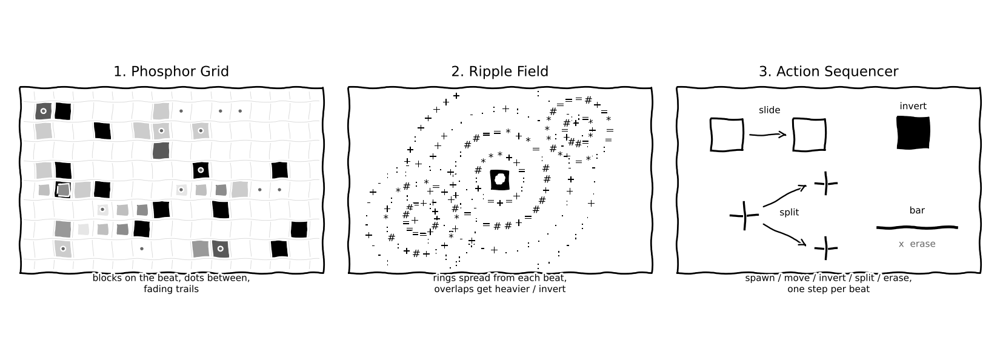

# Green Phosphor *(working title)*

*Sample Student · AET350C Fall 2026 · Project document, Checkpoint 1: Exploration (Assignment 6, Oct 14)*
*Submitted with: `student_sample_cp1.json` (early export) and `student_sample_cp1.mp4` (a 30-second screen recording with sound of my direction 1 experiment)*

---

## 1. Starting points

My starting point is Robert Henke, a co-founder of Ableton and one of the original developers of Ableton Live. AudioPixel is sponsored by Ableton, the musicians perform with Ableton tools, and we'll get tempo and beat phase through Ableton Link, so his work feels like a fitting starting point. He isn't involved in AudioPixel, but he helped build the tools the event runs on. The piece I'm focusing on is his *CBM 8032 AV* [1], an audiovisual performance made entirely on five Commodore CBM 8032 office computers from 1980. Each one has an 8-bit processor and 32 KB of memory. One machine makes the graphics, three make the sound, and one sequences the others. The visuals are nothing but green characters on an 80 × 25 text grid, with no color and no pixel graphics, yet the piece holds a festival audience.

Two things draw me to it:

- **Restraint.** Henke treats the machine's limits as the point of the piece rather than a problem to work around. Every image is built from a small set of block and line characters, so every choice has to count.
- **The image changes; it doesn't reset.** In his technical write-up [2], Henke explains that incoming notes usually *modify* what's already on screen (shapes get altered, moved, or deleted) instead of replacing it. So the order of events matters, and the picture builds up a history. I like that idea for live coding.

I want to understand why something so simple can be so gripping, and whether I can build a live visual with the same kind of restraint in p5.js/JavaScript/Thunk Machine.

## 2. Three directions

All three directions start from Henke's piece but take it somewhere different.

### Direction 1: Phosphor Grid

**What it looks like.** The whole screen is a fixed grid of text characters, all in phosphor green on black. Characters appear in grid cells and fade out slowly, leaving faint trails of light, like an old CRT. Over time the grid fills, empties, and fills again in patterns.

**How it responds to the music.** The beat decides *when* characters appear. The sound decides *which* and *how many*: bass places heavy block characters, and fast, high sounds place small dots and lines. Busier music makes a denser grid; quiet passages leave only a few glowing characters.

**How I'd build it.** A 2D array of cell objects (`{ glyph, brightness }`), two arrays of characters (heavy and light), and a few placement functions (random, row by row, falling columns, diagonal) that I can swap live.

**Promise and risk.** It's the most faithful to what I admire in Henke's work. The risk is monotony over a full set.

### Direction 2: Ripple Field

**What it looks like.** The same green grid, but now waves of characters spread outward like ripples on water. Where ripples overlap, they build up into heavier characters; the peaks flip to inverse (black on green). The screen is always moving.

**How it responds to the music.** Each beat drops a ripple in the center, with its size set by the bass. Fast, high sounds drop small ripples at random spots. Tempo sets how fast the rings spread.

**How I'd build it.** An array of ripple objects (`{ x, y, radius, strength }`), and a "ramp" array of characters from light to heavy. Each frame, every cell adds up the wave height from all the ripples and picks a character from the ramp.

**Promise and risk.** It's much more fluid and dynamic than direction 1, and inspired by the waves of green described in reviews of Henke's show. The risk is that it's more math-heavy and may be harder to perform live.

### Direction 3: Action Sequencer

**What it looks like.** A few small shapes made of box-drawing characters (boxes, crosses, bars) on the green grid. On each beat they appear, slide, flip to inverse, split, or vanish. The image is never redrawn from scratch; it builds up step by step.

**How it responds to the music.** A *sequence* of actions plays one step per beat: spawn, move, invert, split, erase, or rest. The bass decides how big new shapes are.

**How I'd build it.** Shapes stored as small 2D arrays of characters, live shape objects with a position and direction, and an array of action *functions* that plays in order. I'd perform by editing that array, reordering actions or writing new ones.

**Promise and risk.** It's the closest to how Henke's system actually works, and it makes live coding visible: change one array and the choreography changes. The risk is that it might look sparse, and it depends on good timing.

*Rough sketches of the three directions.*

## 3. Experiment

I built a first version of **direction 1** in Thunk Machine as a patch called `phosphorGrid`. It's an 80 × 45 grid of green characters, which fills a 16:9 screen with square cells.

- **The grid** is a 2D array of cell objects, each with a `glyph` (the character) and a `brightness`.
- **Two arrays of characters:** `heavy` blocks (`█ ▓ ▒ ▄ ▀`) and `light` marks (`· : ' -`).
- **On the beat**, heavy characters light up. How many depends on the bass. **In between beats**, light characters appear, depending on the treble.
- **Four placement functions** decide *where* characters land: anywhere at random, row by row, falling down columns, or along a diagonal. I can swap between them by changing one line.
- **Every frame**, each lit character is drawn in green and its brightness is multiplied by 0.95, so it fades out over about a second.

*[Screenshot: the full green grid mid-track, with a scattering of bright block characters and fainter dots fading behind them.]*

## 4. Test with music

I tried the patch with three electronic tracks with a steady beat, around 120–128 beats per minute, and switched between the four placement functions while they played. What I noticed:

- **The fade does most of the work.** With `fade` at 0.95, you can *see* the last beat or two trailing behind, which makes the grid feel connected to the music. Lower values felt twitchy; higher ones turned to mush.
- **Heavy on the beat and light in between makes the rhythm readable.** The light characters in between beats filled in the rhythm, so it reads as more than a plain pulse.
- **Bass driving the count works.** When the bass dropped out in one track, the heavy characters thinned out on their own. The treble count was harder to see; 15 may be too low.
- **Placement changes everything.** `placeRandom` got repetitive after a couple of minutes because it looks the same everywhere. `placeColumns` and `placeRow` felt much more alive, because you can see a pattern building up. Swapping between them live was the most interesting part, which fits Henke's "modify, don't replace" idea.
- **Performance is fine so far.** The FPS readout stayed steady even though the patch loops over all 3,600 cells every frame. I'll keep watching it as I add more.

*[See the 30-second recording, `student_sample_cp1.mp4`. It shows only direction 1, the `phosphorGrid` patch, running with one of the practice tracks while I switch placement functions. Directions 2 and 3 are sketches for now.]*

## 5. Direction and question

I'm going to develop **direction 1, the Phosphor Grid**, as the foundation. The experiment already works and feels close to Henke's piece. But the test showed it needs more variety, so I plan to borrow from the other two directions: ripples (direction 2) and a sequence of actions that change the existing image (direction 3) could become different *scenes* within the same grid.

**My question:** can a one-color character grid hold an audience's attention through a 10-minute set of high-energy music, and what does it need in order to do that? My guess is that the answer is change over time: different rules for placing characters, and an image that builds up instead of resetting.

---

## Credits

- [1] Robert Henke, *CBM 8032 AV* (2019–2025). https://roberthenke.com/concerts/cbm8032av.html
- [2] Robert Henke, *Inside CBM 8032 AV* (technical write-up). https://roberthenke.com/technology/inside8032av.html

## AI use

I used an AI assistant to create the rough sketches of my three directions in Section 2, from my written descriptions of each one. The ideas and descriptions are my own.
